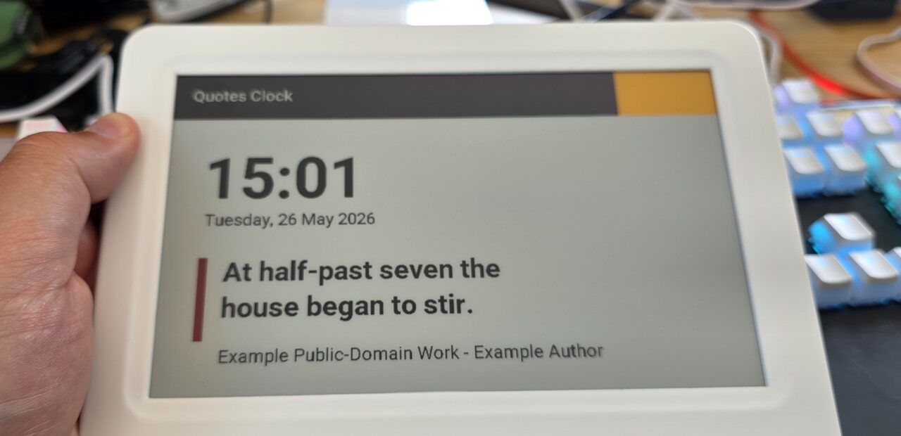
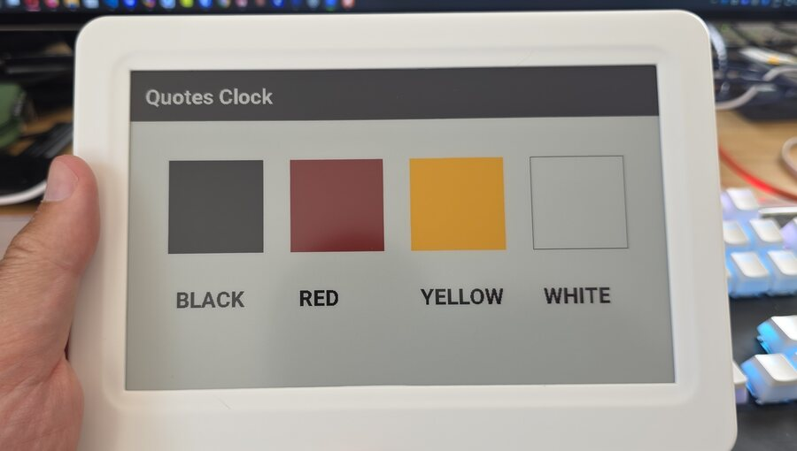

# Quotes Clock

Quotes Clock is an ESP32-based literary clock for 7.5 inch four-color e-paper price tags.

The firmware displays a time-specific quote from a local quote-data partition. The public repository includes the native ESP-IDF firmware, quote-library tooling, build scripts, documentation, and a small rights-safe sample quote file for validation.

<p align="center">
  
</p>

<p align="center">
  
</p>

## Current Status

This is a working prototype firmware and tooling tree, not a finished consumer product.

Implemented in this repository:

- Native ESP-IDF firmware for ESP32-WROOM-32D based ESP32-M075 tags.
- JD79660/GDEM075F52 800 x 480 four-color e-paper display driver.
- Local quote rendering from a generated `quote_data` partition.
- Time-specific quotes, optional classic/general quotes, quote cadence controls, and time-phrase highlighting.
- Display layout controls for orientation, clock visibility, quote visibility, top/bottom bars, sidebar, colors, margins, date format, 12/24 hour time, and a clock-only watch style.
- Main-pane and clock partial refresh paths, daily full-refresh guard, display timing telemetry, and a display watchdog.
- Wi-Fi station mode with DHCP or static IPv4 settings.
- Fallback setup AP using the `quotes-clock-xxxx` naming pattern.
- HTTPS admin UI/API for first-run password setup, status, Wi-Fi, display, time/SNTP settings, manual refresh, saved-Wi-Fi recovery, OTA firmware upload, and license notes.
- SNTP time sync using the default pool, DHCP option 42, or manual NTP servers.
- Python tools for quote validation, coverage reports, glyph checks, dataset imports, quote-library merging, native asset generation, TLS bootstrap generation, binary-size checks, rescue-image packaging, and public release checks.

Not implemented in this repository:

- A rights-cleared public quote corpus for all 1,440 minutes.
- RSS/news ingestion.
- Book-cover fetching or cover rendering.
- Weather or calendar display.
- LLM summarisation.
- Static hosted OTA manifest polling/downloads.
- Per-device production certificate provisioning.

Some planning documents discuss those future features, but the firmware and README should be read as describing the implemented prototype above.

## Quote Data

The public build default is `data/quotes.sample.yaml`. It contains only a few sample entries so the tools and firmware generation path can be tested without bundling uncleared third-party passages.

Imported quote datasets are intentionally not bundled in the public tree. They may include third-party passages and should be treated as local staging material until each entry's rights and quality have been reviewed.

Full generated corpora, including the classic quote corpus, are staging artifacts until that review is complete.

Quote libraries are authored as YAML, then compiled into native assets:

- `quotes_clock_assets.hpp`: generated fonts and display assets.
- `quote_data.bin`: compact native quote-data partition image.

The ESP32 firmware does not parse YAML at runtime.

## Build Requirements

- Python 3.12 and `uv` for the tooling.
- ESP-IDF v6.0.x for firmware builds.
- TLS bootstrap material for local HTTPS builds. Copy `.env.example` to `.env` and set either `QUOTES_CLOCK_TLS_CERT_PEM` / `QUOTES_CLOCK_TLS_KEY_PEM` or their base64 variants.

For untrusted CI/PR validation, the build can use an ephemeral throwaway self-signed certificate. Do not ship multiple devices with the same long-lived private key.

## Useful Commands

Validate the public sample quote data:

```powershell
uv run python tools/validate_quotes.py data/quotes.sample.yaml
```

Report quote coverage:

```powershell
uv run python tools/report_quote_coverage.py data/quotes.sample.yaml --sparse-threshold 3
```

Check display glyph support:

```powershell
uv run python tools/report_display_text_glyphs.py data/quotes.sample.yaml
```

Run the public-release guard:

```powershell
uv run python tools/check_release_tree.py --quote-data data/quotes.sample.yaml
# or:
make release-check
```

Generate native firmware assets:

```powershell
.\build.ps1 native-idf-assets
# or, on Linux:
make native-idf-assets
```

Build the native ESP-IDF firmware:

```powershell
.\build.ps1 compile-native-idf
.\build.ps1 check-native-idf-size
# or, on Linux:
make compile-native-idf
make check-native-idf-size
```

Build a single rescue-flash image containing the bootloader, partition table, OTA data, app, and quote-data partition:

```powershell
.\build.ps1 native-idf-rescue-bin
# or, on Linux:
make native-idf-rescue-bin
```

Flash a device:

```powershell
.\build.ps1 flash-native-idf -SerialPort COM6
# or, on Linux:
make flash-native-idf PORT=/dev/ttyUSB0
```

Flash only the native quote-data partition after quote changes:

```powershell
.\build.ps1 flash-native-idf-quote-data -SerialPort COM6
# or, on Linux:
make flash-native-idf-quote-data PORT=/dev/ttyUSB0
```

## Documentation

- [Native ESP-IDF firmware](firmware/native-idf/README.md)
- [Quote library format](docs/quote-library.md)
- [Device settings notes](docs/device-settings.md)
- [Provisioning notes](docs/provisioning.md)
- [Timekeeping notes](docs/timekeeping.md)
- [Dataset and rights notes](docs/datasets.md)
- [Roadmap](ROADMAP.md)

## Rights And Licensing

Quotes Clock source code, firmware, scripts, and project documentation are open source under the MIT License.

Third-party software and content notices are tracked in `THIRD_PARTY_NOTICES.md`. Quote text and imported datasets remain subject to their own rights and license terms.
